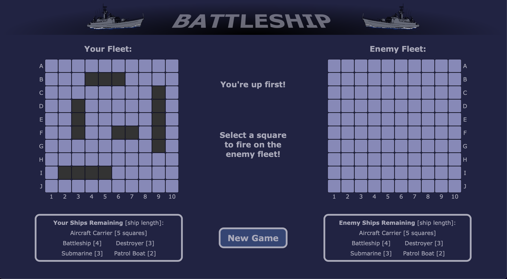

# Battleship

by John A. Joyce 

## Description

Battleship is a two-player strategic guessing game with origins as a pencil-and-paper game played around the world since World War I. While there have been many variants of the game, the objective is to sink the opponent's fleet of ships, the locations of which are unknown to each player. 

Each player's fleet contains multiple ships of different sizes, arranged on a grid. Players alternate turns choosing coordinates to "fire" at their opponent's grid, aiming to hit and sink their ships. The player who sinks their opponent's entire fleet first wins the game. 

## Screenshots 

 
 
 
 
 

## Technologies Used 

JavaScript, jQuery, CSS, HTML 

## Gameplay

You will play the game against a computer opponent. Your fleet is shown on the grid on the left. The computer opponent's "Enemy Fleet" is on the grid on the right, but the locations of the enemy ships are hidden from you. In this version of the game, each fleet contains five ships with the following lengths: 

* Aircraft Carrier [5 squares]
* Battleship [4 squares]
* Destroyer [3 squares]
* Submarine [3 squares]
* Patrol Boat [2 squares]

You get to fire first. Select a square on the "Enemy Fleet" grid to fire at it and see whether you hit one of their ships or missed. It will then be the computer opponent's turn to fire at your fleet, and you will see where they fired and whether they hit one of your ships. When a ship is hit, a red X will be shown on the corresponding square to track the locations. 

A ship is sunk when all of its squares have been hit, at which point a message in the center will announce which ship was sunk and it will be crossed out from the fleet key listing the ships remaining below each grid. 

The turns will continue to alternate until either you sink the entire enemy fleet or they sink yours. To start over, click the "New Game" button. 

## Next Steps

This game is currently a "Minimum Viable Product," and I hope to improve on it soon. It's currently designed for larger screen sizes. For the best experience now, play it on a computer in a large enough browser window (roughly at least 1200px). I plan to update the CSS, the layout, and the display rendering code soon to optimize for smaller screen sizes. 

More features I hope to add soon: 

* The ability to choose your own ship positions on your grid 
* A "smarter" computer opponent 
* Visual improvements, better message display functions and animations, etc. 

## Sources and References

Ship vector image by Marjorie012 on FAVPNG.com: 
https://favpng.com/png_view/vector-hand-painted-ship-ship-euclidean-vector-png/krxdjTjP 

Battleship (game) on Wikipedia: 
https://en.wikipedia.org/wiki/Battleship_(game) 

Stack Overflow: https://stackoverflow.com/ 

jQuery API Documentation: https://api.jquery.com/ 

MDN Web Docs: https://developer.mozilla.org/en-US/ 

W3Schools JavaScript and CSS References: 
https://www.w3schools.com/jsref/default.asp 
https://www.w3schools.com/cssref/default.asp 

